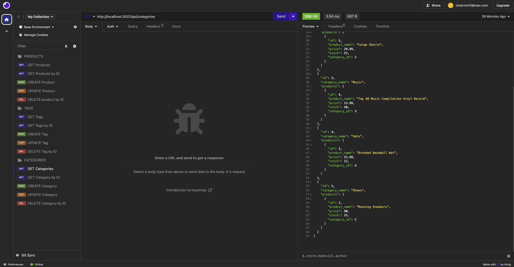
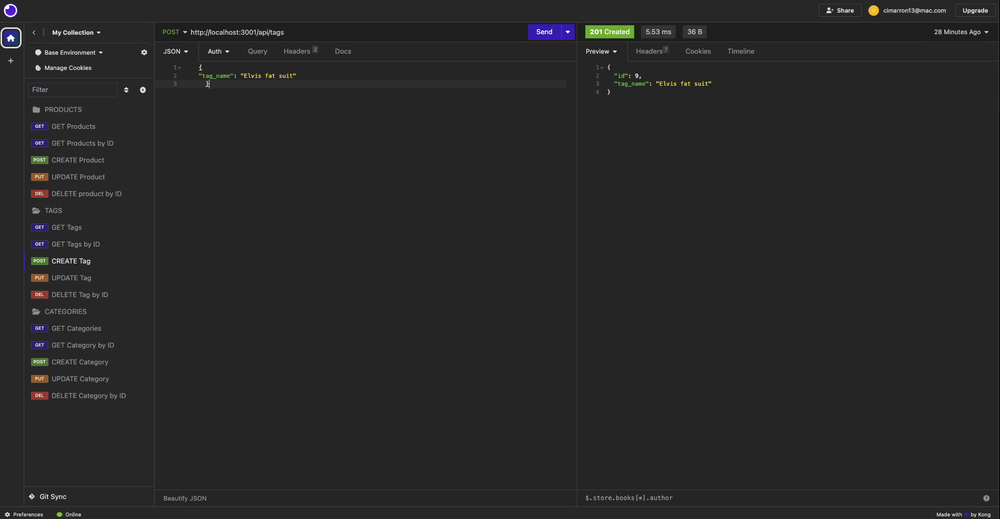

# E-COMMERCE_BACK_END

## Description

- This is the back end for an e-commerce website that utilizes the latest technologies to help your company compete with other e-commerce businesses. It provides a functional Express.js API and uses Sequelize to interact with a MySQL database.

## Table of Contents

- [Installation](#installation)
- [Usage](#usage)
- [Credits](#credits)
- [License](#license)
- [Features](#features)
- [Contributing](#contibuting)
- [Tests](#tests)
- [Questions](#questions)

## Installation

1. Clone repository <a href="https://github.com/cjenschke/E-Commerce_Back_End">GitHub E-COMMERCE_BACK_END</a> to your local machine.

2. To install the required packages, use the following command: `npm install`

   - [MySQL2](https://www.npmjs.com/package/mysql2)
   - [Sequelize](https://www.npmjs.com/package/sequelize)
   - [dotenv](https://www.npmjs.com/package/dotenv)

3. Create a `.env` file in the project root directory and add your database credentials:

4. Use the `schema.sql` file in the `db` folder to create your database using MySQL shell commands.

5. Set up your environment variables to store sensitive data like your MySQL username, password, and database name.

6. Run the application to start the server and sync Sequelize models to the MySQL database.

## Usage

[Demo Video](https://drive.google.com/file/d/1KzA6jxmi_sbfW4aHpVvC6mDIGjorogMU/view?usp=sharing)

To start the application, use: `npm start`

## Credits

- University of Texas edX Boot Camps
- Xpert Learning Assistant
- ChatGPT 3.5

## License

## Features

database

## Contributing

- This project is not open for contributions at the moment.

## Tests

## Questions

If you have questions, you can contact me at [cimarron13@mac.com](mailto:cimarron13@mac.com) or <a href="https://github.com/cjenschke">GitHub</a>.
